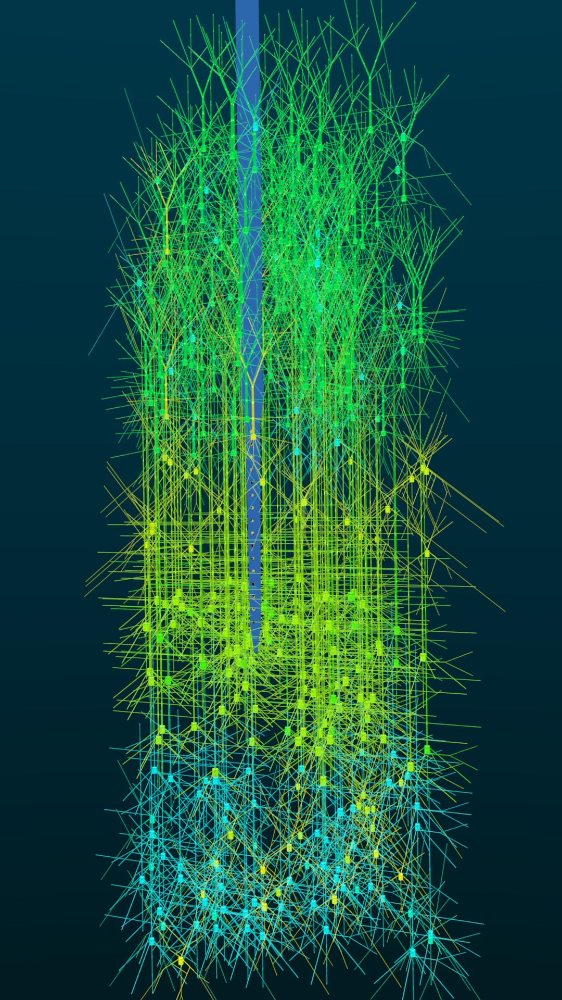

# BlenderNEURON

A Python package and an addon that takes a NEURON simulator model and exports its 3D structure and membrane activity to Blender. The export can be peformed via NEURON GUI or via Python commands.

  

## NEURON GUI

The tool is integrated with NEURON to provide a simple user interface and a set of Python commands that can be used to visualize and inspect single cell or network morphology and activity.

## Blender GUI:

## Install Steps and Documentation
Instructions for how to install and use BlenderNEURON can be found here: [BlenderNEURON Documentation](http://blenderneuron.org/docs)

## Example Cells and Activity

|        |   |
|----------------------------------|----------------------------------|
| Neocortex Layer 5 Pyramidal Cell | Hippocampus CA1 Pyramidal Cell   |
|          |  |
| Cerebellum Purkinje Cell         | Neocortex Layer 5 Basket Cell    |

## Example Networks
Example visualization of Traub et. al. (2005) cortical column model, also showing a model of a nano-fabricated electrode:

Virtual slices can be created by manipulating Blender's camera clipping distances. An example of a virtual slice of an olfcatory bulb model (colors represend different cell types):

Example visualizations of an olfactory bulb model (Migliore et. al. 2014).

A network of about 60 mitral cells

3D structure and activity of a 5 mitral cell network and several accompanying granule cells

Activity of 1 mitral cell with several hundred companion granule cells

## Interactive models can be embedded in websites

Exported models can be saved as .blend files and uploaded to 3D model sharing websites like Sketchfab.com. The uploaded model can be embedded in websites which allows aspects of the model to be explored interactively without any software.

<iframe width="980" height="480" src="https://sketchfab.com/models/b96d4062f1294fdbb88a53c56614a16e/embed?autospin=0.2" frameborder="0" allow="autoplay; fullscreen; vr" mozallowfullscreen="true" webkitallowfullscreen="true"></iframe>

    <a href="https://sketchfab.com/models/b96d4062f1294fdbb88a53c56614a16e?utm_medium=embed&utm_source=website&utm_campaign=share-popup" target="_blank" style="font-weight: bold; color: #1CAAD9;">Neocortical Column Model with Electrode</a>
    by <a href="https://sketchfab.com/justasb?utm_medium=embed&utm_source=website&utm_campaign=share-popup" target="_blank" style="font-weight: bold; color: #1CAAD9;">justasb</a>
    on <a href="https://sketchfab.com?utm_medium=embed&utm_source=website&utm_campaign=share-popup" target="_blank" style="font-weight: bold; color: #1CAAD9;">Sketchfab</a>

