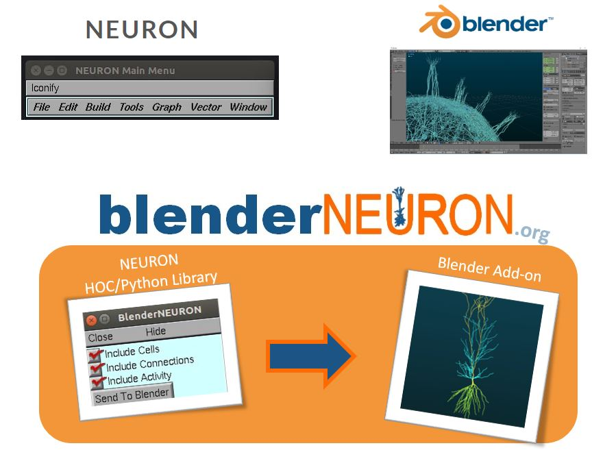

============
Introduction
============

.. image:: files_static/logo.png

BlenderNEURON is a software tool that enables to use Blender, an open-source high-performance 3D modeling tool to
visualize and edit models built with NEURON simulator. 

********
Features
********

 - NEURON models can be in any format (HOC or Python)
 - Cell/Network morphology inspection
 - Membrane potential (or any other membrane variable) visualization over time
 - Replay, step-through, scrubbing through simulation output
 - Adjustable level of detail (supports single cell or large network models)
 - Render as static images or video files
 - Blender files can be uploaded and shared on `Sketchfab <https://Sketchfab.com>`_
 - Python API to automate any task
 
****************************
Projects Using BlenderNEURON
****************************

 - `NeuroML-DB.org <https://neuroml-db.org/>`_
 - `Biophysically Realistic Model of the Olfactory Bulb <http://olfactorybulb.org/>`_

*********************
Developers
*********************

 - `Justas Birgiolas Ph.D. <https://www.linkedin.com/in/justasbirgiolas>`_
 - `Arizona State University ICON Lab <https://iconlab.asu.edu/>`_

********
Sponsors
********

 - National Institutes of Health
 - `Institute for Conscious Automaton Research <https://IFCAR.org>`_

***************
Architecture
***************

The tool consists of two parts: 

1) The Python library, which runs inside NEURON
2) The Blender Addon, which runs inside Blender

These two parts exchange information and allow importing/exporting models between NEURON and Blender.

